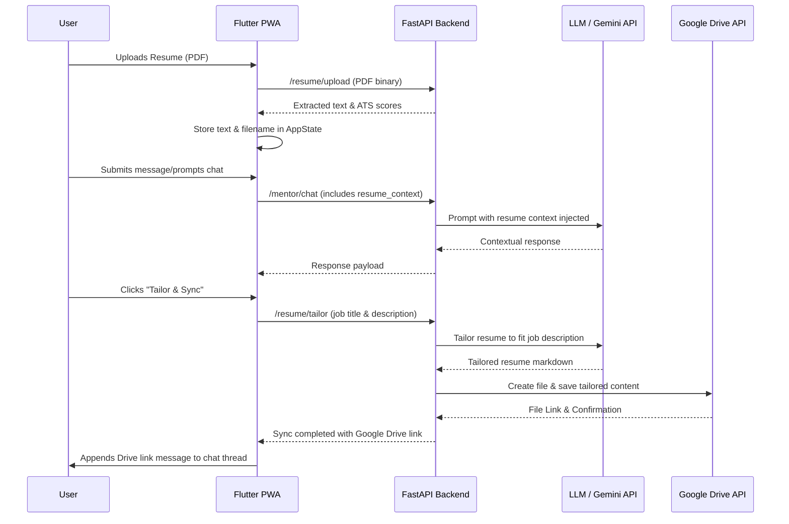

# AI Resume Tailoring & Google Drive Integration Guide

This document provides a comprehensive integration and feature guide for the automated PDF-to-Google Drive resume-tailoring pipeline in the DevMentor AI Coach application.

---

## 🏗 System Architecture

The workflow connects the Flutter PWA frontend, the FastAPI backend, and Google Drive (via OAuth).



---

## 🛠 Backend Integration

The backend handles AI-based response generation, resume text extraction, PDF parsing, tailoring, and syncing to Google Drive.

### 1. Schema Extensions
The `/mentor/chat` endpoint's request payload accepts an optional `resume_context` containing the extracted text from the user's active resume.

**Location**: `backend/app/api/v1/endpoints/mentor.py`
```python
class MentorMessageRequest(BaseModel):
    message: str
    history: List[dict] = []
    resume_context: Optional[str] = None
```

### 2. Prompt Construction & Context Injection
When the user sends a message and has an active resume uploaded, the request includes the `resume_context`. The backend prepends this context to the system prompt of the career coach LLM session.

**Location**: `backend/app/api/v1/endpoints/mentor.py`
```python
@router.post("/chat")
async def mentor_chat(
    request: MentorMessageRequest,
    db: Session = Depends(deps.get_db),
    current_user: User = Depends(deps.get_current_active_user),
):
    ...
    system_prompt = "You are DevMentor AI, a professional career coach..."
    if request.resume_context:
        system_prompt += f"\n\nActive Resume Context:\n{request.resume_context}"
    ...
```

---

## 📱 Frontend Integration

The frontend consists of state variables inside `AppState` and user-friendly, high-fidelity UI components.

### 1. AppState (State & Actions)
*   `lastUploadedResumeText`: Stores the text extracted from the PDF. Passed to every `/mentor/chat` request if not empty.
*   `lastUploadedResumeFileName`: Persisted filename of the uploaded PDF to show the active resume context.
*   `isGoogleDriveConnected` / `isCheckingGoogleDriveStatus`: Keeps track of OAuth sync state.
*   `generateAndSyncResumeFromChat(jobTitle, jobDescription)`: Orchestrates the tailoring API call, shows active loading indicator, and appends a Google Drive link to the chat upon successful completion.

### 2. Liquid Glass Chat & Input UI
*   **Active Resume Bar**: Floating translucent bar displayed below the app bar. Displays active resume filename and Google Drive connection status.
*   **Floating Input**: Glassmorphic input field floating above the bottom area with custom border gradients and backdrop blurs.
*   **Attachment Sheet**: A modal bottom drawer triggering:
    1.  *Upload PDF Resume* - Select and parse a PDF.
    2.  *Google Drive Sync Settings* - Check status or launch OAuth authorization.

---

## 🚀 Setup & Execution

### 1. Backend Verification
To run the backend test suite:
```bash
cd backend
.venv/bin/pytest
```

### 2. Frontend Verification
To check the Flutter app analyzer:
```bash
flutter analyze
```
